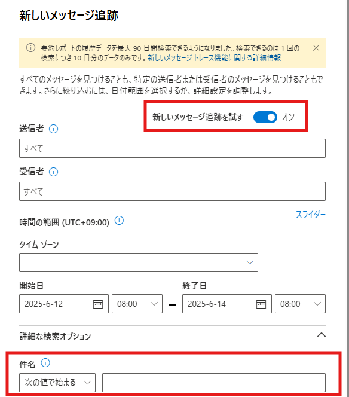

---
title: >
  MessageTraceV2 の紹介
date: 2025-06-13
tags: Exchange Online
alias: MessageTraceV2 の紹介/index.html
---

こんにちは。Exchange / Outlook サポートの柳本です。以前より[こちら](https://jpmessaging.github.io/blog/Exchange-Online-Message-Tracking-Log/)の記事で、HistoricalSearch と呼ばれる Exchange Online で提供されている中で最も詳細なメッセージ追跡ログを紹介していました。  
今回は新たに MessageTraceV2 と呼ばれる種類のメッセージ追跡ログが追加されましたのでご紹介いたします。  

## MessageTraceV2 とは
MessageTraceV2 とは、従来の MessageTrace (以降 MessageTraceV1) に改良を加えたメッセージ追跡ログです。  
MessageTraceV2 はここしばらくパブリック プレビュー版でご提供しておりましたが、[こちらの記事](https://jpmessaging.github.io/blog/announcing-general-availability-ga-of-the-new-message-trace-in-exchange-online/)でもアナウンスが合った通り一般提供が開始されました。

MessageTraceV2 は Exchange 管理センターと PowerShell の Get-MessageTraceV2 コマンドの両方で利用可能です。  
Exchange 管理センターと Get-MessageTraceV2 コマンド両方に共通している <span style="background: linear-gradient(transparent 80%, #ffcc99 80%)">MessageTraceV1 からの大きな改善点は以下の 2 点です。</span>

- **最大で過去 90 日前までのログを取得可能 (ただし、一度の取得で 10 日間以内)**
- **メールの件名でフィルターが可能**

\* MessageTraceV1 は最大で過去 10 日まで かつ 件名でのフィルターは不可

これまでは 10 日より前のログを取得したい場合には[こちら](https://jpmessaging.github.io/blog/Exchange-Online-Message-Tracking-Log/)で紹介している HistoricalSearch を使用する必要がありました。  
しかしながら、HistoricalSearch はメールの送受信からログに反映されるまでに時間を要したり、HistoricalSearch 自体の取得にも時間を要したり、気軽に取得することが難しいという欠点がありました。  
MessageTraceV2 は HistoricalSearch よりも比較的短時間でログに反映され、かつログの取得も短時間で行うことが可能です。  
メールのステータスや受信日時などの簡単な情報だけをすぐに確認したい機会は多いと思いますので、お客様にも MessageTraceV2 のメリットを感じていただけるのではないでしょうか。

ただし、あくまで MessageTraceV2 は MessageTraceV1 の後継であるため、取得できる内容に変更はありません。  
<span style="background: linear-gradient(transparent 80%, #ffcc99 80%)">最も詳細なメッセージ追跡ログは HistoricalSearch であるという点も変わりはありませんので、弊社がトラブルシューティングのご支援を行う場合には引き続き HistoricalSearch の取得を依頼させていただく場合が多いことをご了承ください。</span>

それでは MessageTraceV2 を Exchange 管理センターと PowerShell の Get-MessageTraceV2 コマンドそれぞれで取得する方法を見ていきましょう。

## Exchange 管理センターで取得する場合
Exchange 管理センターでは **[Exchange 管理センター] > [メール フロー] > [メッセージ追跡]** より MessageTraceV2 を利用可能です。  
以下の URL より直接開くことも可能です。

https://admin.exchange.microsoft.com/#/messagetrace

以下の画面では **[新しいメッセージ追跡を試す]** のトグルをオンにすることで MessageTraceV2 になります。  
トグルをオンにすることで件名を入力する項目が増えます。

  

後はお好みの条件を指定して実行するだけです。ただし、上述の通り一度に取得できる期間は 10 日までであることにご注意ください。

※ MessageTraceV2 を利用するためには [レポートの種類] を **[要約レポート]** に設定する必要があります。  


## Get-MessageTraceV2 コマンドで取得する場合
事前準備として、Powershell から Exchange Online に接続します。詳細は下記の公開情報をご参照ください。  
なお、Get-MessageTraceV2 は継続的に改良が加えられておりますので、<span style="background: linear-gradient(transparent 80%, #ffcc99 80%)">最新版の ExchangeOnlineManagement モジュールへ更新した上でご利用ください。</span>

[Exchange Online PowerShell に接続する](https://learn.microsoft.com/ja-jp/powershell/exchange/connect-to-exchange-online-powershell?view=exchange-ps)

冒頭に記載した MessageTraceV2 の特徴 (取得期間と件名でのフィルター) 以外にも細かな差異はありますが、基本的な使い方は従来の Get-MessageTrace コマンドと同等です。  
最も大きな差異は Get-MessageTraceV2 コマンドにはページング機能がないことです。  
そのため、多数のログを取得する方法が従来の Get-MessageTrace コマンドとは異なっておりますが、その方法は後述します。  
まずは基本的な使い方をご紹介します。

### パラメーターを指定しないで実行する
まず、以下の通り何もパラメーターを付けないで実行することができます。  

```PowerShell
Get-MessageTraceV2
```

この場合、過去 48 時間以内のログが取得され、かつ最大で 1,000 件までのログが表示されます。  
<span style="background: linear-gradient(transparent 80%, #ffcc99 80%)">出力結果はまず受信日時 (Received) で降順で並び替えられ、同一受信日時内では受信者のメール アドレス (RecipientAddress) で昇順に並び替えられて表示されます。</span>

### 開始/終了日時と出力結果数を指定する
以下は検索対象の開始/終了日時と出力結果数を指定する例です。  

```PowerShell
Get-MessageTraceV2 -StartDate "2025-06-05Z" -EndDate "2025-06-15Z" -ResultSize 100
```

<span style="background: linear-gradient(transparent 80%, #ffcc99 80%)">開始/終了日時は最大で過去 90 日前まで指定できますが、一度に指定できるのは最大 10 日間です。  
出力結果数 (-ResultSize) は 1 から 5,000 の間で指定可能です。</span>

#### 日時についての補足
-StartDate や -EndDate パラメーターには日時を指定できますが、様々な表記で指定することができます。  
本ブログでは ISO 8601 で定められた表記に従って `2025-06-05Z` のように記載しています。  
これは、末尾に `Z` を付与することで明示的に UTC (協定世界時) で指定していることを示しています。  
日本時間は UTC より 9 時間進んでいます (UTC + 9 時間)。

もし明示的に日本時間で指定する場合には `2025-06-05+09:00` と記載します。  
更に、時刻まで指定する場合には `2025-06-05T10:00:00+09:00` (日本時間 10:00) となります。  

意図しない結果が取得されてしまうことを防ぐためにも、タイムゾーンは明示的に指定することをおすすめします。  
<span style="background: linear-gradient(transparent 80%, #ffcc99 80%)">取得したい対象のメールが定まっており、取りこぼしを防ぎたい場合には少し広めの日時を指定することも有効です。</span>

<span style="background: linear-gradient(transparent 80%, #ffcc99 80%)">なお、指定方法に依らず Get-MessageTraceV2 コマンドの出力結果は UTC で表記されています。</span>

### 件名でフィルターする
以下はメールの件名でフィルターする例です。  

```PowerShell
Get-MessageTraceV2 -Subject "1 on 1" -SubjectFilterType StartsWith
```

-SubjectFilterType パラメーターで以下の中からフィルター方法を選択可能です。

- Contains: 部分一致
- EndsWith: 後方一致
- StartsWith: 前方一致  
※パフォーマンスの観点から、可能な限り EndsWith または StartsWith をご利用いただくことを推奨しております。

### 多数のログをページングする
最後に多数のログを出力する場合の方法をご紹介します。  
多数のログを出力する必要がある場合、少数のログを小分けにして複数回取得する方法 (ページング) があります。  

Get-MessageTraceV2 コマンドでは、従来の Get-MessageTrace コマンドでは使用できたページングのためのパラメーター (-Page や -PageSize) が使用できなくなりました。
そこで、Get-MessageTraceV2 コマンドの結果が受信日時で降順に並べらているという特徴と、新たに導入された -StartingRecipientAddress パラメーターを使用してページングを実現します。

まず、以下の通り開始/終了日時を絞った上でページ サイズ (1 回当たりの取得数) を指定してコマンドを実行します。その他のフィルターは適宜追加ください。  
また、結果は変数に格納されますので、必要に応じてファイルに出力するなどして活用ください。

```PowerShell
$mt1 = Get-MessageTraceV2 -StartDate "2025-06-05Z" -EndDate "2025-06-15Z" -ResultSize 10
```

この時、以下のような警告が表示される場合があります。  
これは、指定した条件に合致するログが更に存在することを示しております。  
警告が表示されなくなるまで、残りのログを取得していきましょう。


    WARNING: There are more results, use the following command to get more. Get-MessageTraceV2 -StartDate "2025-06-05T00:00:00.0000000Z" -EndDate "2025-06-12T03:01:53.7240000Z" -StartingRecipientAddress "xxxx@contoso.com" -ResultSize 10

次に、以下の通りコマンドを実行することで続きのログを取得することが可能です。  
Get-MessageTraceV2 コマンドの結果は受信日時で降順に並べらているという特徴がありますので、このように指定することで前回の結果の最後の行 (前回の結果で一番古い日) から続きを取得することが可能となります。  

```PowerShell
$mt2 = Get-MessageTraceV2 -StartDate "2025-06-05Z" -EndDate $mt1[-1].Received.ToString("O") -ResultSize 10 -StartingRecipientAddress $mt1[-1].RecipientAddress
```

-StartDate には前回の実行時と同じ値を指定します。  
-EndDate には前回の実行結果の最後のログに記録されている受信日時を指定しています。  

後は以下の通り繰り返し実行し、上記の警告が表示されなくなったタイミングで全てのログが取得できたことになります。

```PowerShell
$mt3 = Get-MessageTraceV2 -StartDate "2025-06-05Z" -EndDate $mt2[-1].Received.ToString("O") -ResultSize 10 -StartingRecipientAddress $mt2[-1].RecipientAddress
$mt4 = Get-MessageTraceV2 -StartDate "2025-06-05Z" -EndDate $mt3[-1].Received.ToString("O") -ResultSize 10 -StartingRecipientAddress $mt3[-1].RecipientAddress
...
```

上記コマンドをお客様のご要望に合わせてスクリプト化することもご検討ください。

#### -StartingRecipientAddress パラメーターに関する補足
ページングをする時のコマンドに見慣れないパラメーター -StartingRecipientAddress が登場したことにお気づきかと思います。  
-StartingRecipientAddress パラメーターは上記例のように特に意味を気にせず付けていただいて構いませんが、もう少し詳細に解説します。

-StartingRecipientAddress パラメーターの目的はログを重複することなく効率的に取得することです。  
逆に言うと、-StartingRecipientAddress パラメーターがない場合には重複したログを取得してしまう可能性があるということです。

Get-MessageTraceV2 コマンドの出力結果は 1 受信者につき 1 ログ (1 行) として記録されます。  
つまり、1 通のメールに複数の受信者が含まれている場合には、同じ受信日時に複数行ログが出力されることとなります。  

上記で紹介したページングを行うためのコマンドでは、前回実行したコマンドの最終行にある受信日時を次回の -EndDate パラメーターに指定しています。  
-EndDate パラメーターだけの指定では、以下の例のように複数回のコマンドで重複したログを取得してしまう可能性があります。


これを防ぐために、-StartingRecipientAddress パラメーターは「指定した受信者の次の受信者からログ取得を開始する」ことを意味します。  
つまり、前回の結果に含まれる最後の受信者を指定しておけば間違いありません。

Get-MessageTraceV2 コマンドにはこれまでにご紹介したパラメーター以外にも -Status や -SenderAddress など、従来の Get-MessageTrace コマンドでも利用可能だったパラメーターを組み合わせてお使いいただけます。
詳細はコマンド リファレンス ([Get-MessageTraceV2](https://learn.microsoft.com/en-us/powershell/module/exchange/get-messagetracev2?view=exchange-ps)) をご参照ください。

#### スロットリングに関する補足
Get-MessageTraceV2 コマンドおよび Get-MessageTraceDetailV2 コマンドにはスロットリングの制限が設けられております。  
これには、コマンドを大量に実行することで Exchange Online のリソースを大きく消費してしまうことを防ぎ、多くのお客様に平等にサービスをご利用いただけるようにする目的があります。

これらのコマンドの制限は以下の通りテナント単位で設定されております。  
スクリプト等でコマンドを大量に実行される予定のあるお客様はご注意ください。

|コマンド|テナント単位の制限値|
|-|-|
|Get-MessageTraceV2|100 リクエスト / 5 分|
|Get-MessageTraceDetailV2|100 リクエスト / 5 分|

## MessageTraceV1 の廃止
Exchange 管理センターおよび Get-MessageTrace/Get-MessageTraceDetail コマンドで取得可能な <span style="background: linear-gradient(transparent 80%, #ffcc99 80%)">MessageTraceV1 は 2025 年 9 月 1 日に廃止が開始される予定です。</span>  
それまでの間は MessageTraceV1 と MessageTraceV2 を並行してご利用いただくことが可能です。  

また、Reporting web service を使用したメッセージ追跡ログ ([MessageTrace report](https://learn.microsoft.com/en-us/previous-versions/office/developer/o365-enterprise-developers/jj984335(v=office.15))) も同日に廃止が開始されます。  
MessageTraceV2 は Reporting web service では提供されません。  
そのため、Reporting web service をご利用のお客様も PowerShell の Get-MessageTraceV2 コマンドへの以降をご検討ください。

## 参考情報

- MessageTraceV2 の GA (一般提供) をお知らせしたブログ  
[Announcing General Availability (GA) of the New Message Trace in Exchange Online](https://techcommunity.microsoft.com/blog/exchange/announcing-general-availability-ga-of-the-new-message-trace-in-exchange-online/4420243) (日本語抄訳版は[こちら](https://jpmessaging.github.io/blog/announcing-general-availability-ga-of-the-new-message-trace-in-exchange-online/))

- MessageTraceV2 の詳細についてご案内したブログ  
[Announcing Public Preview of the New Message Trace in Exchange Online](https://techcommunity.microsoft.com/blog/exchange/announcing-public-preview-of-the-new-message-trace-in-exchange-online/4356561)

- MessageTraceV2 に関する公開情報  
[New Message trace in Exchange admin center in Exchange Online](https://learn.microsoft.com/en-us/exchange/monitoring/trace-an-email-message/new-message-trace)

---
**本情報の内容（添付文書、リンク先などを含む）は、作成日時点でのものであり、予告なく変更される場合があります。**